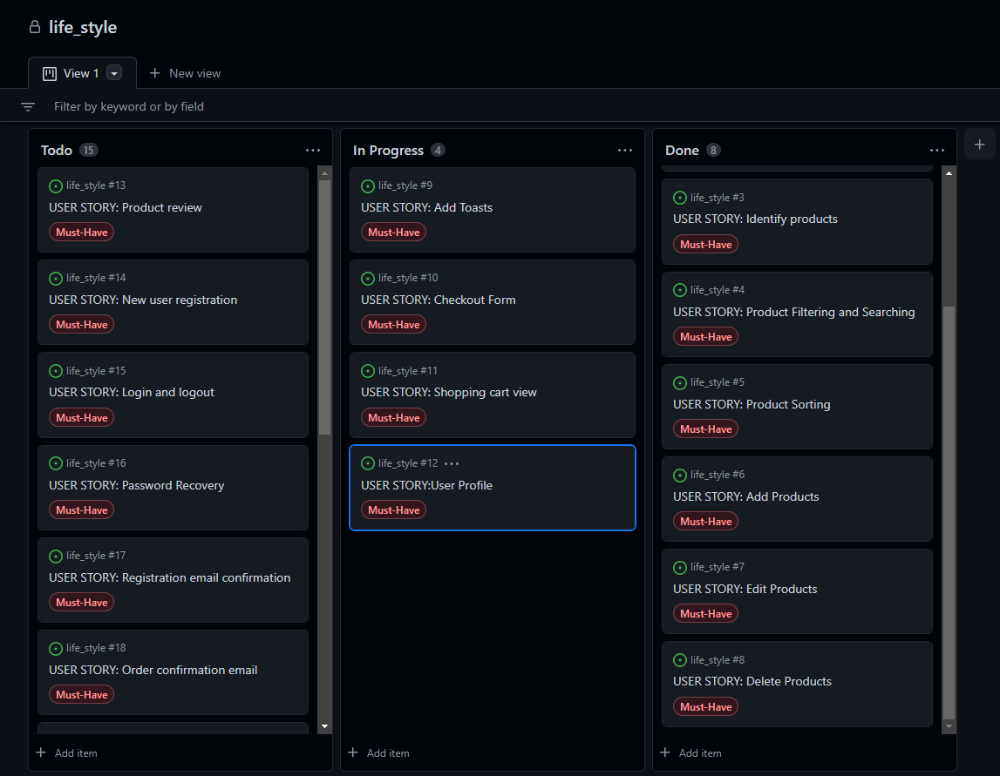

# LifeStyle
LifeStyle is a ecommerce website which offers different varieties of home decor products.

At LifeStyle we specialise in providing all aspects of homewares and want to make homewares as accessible and affordable as possible. 

LifeStyle have a great range of homewares and products, with many beautiful ornaments and items of home décor, and you’re sure to find something beautiful. We have homewares that can suit any home, and we always want to make your home more beautiful and somewhere special that is truly your own.

## Table of Contents

1. [User Experience (UX)](#user-experience-ux)
    1. [Strategy](#strategy)
        1. [Project Goals](#project-goals)
        2. [User Goals](#user-goals)
        3. [Strategy Table](#strategy-table)
    2. [Scope](#scope)
        1. [User Stories](#user-stories)
    3. [Structure](#structure)
        1. [Database Model](#database-model)
    4. [Skeleton](#skeleton)
        1. [Wireframes](#wireframes)
    5. [Surface](#surface)
        1. [Color Scheme](#color-scheme)
        2. [Typography](#typography)
2. [Marketing](#marketing)
   1. [Search Engine Optimisation](#search-engine-optimisation)
   2. [Business Model](#business-model)
3. [Features](#features)
   1. [General](#general)
   2. [Home Page](#home-page)
   3. [Products Page](#products-page)
   4. [Product Details Page](#product-details-page)
   5. [Products Admin](#products-admin)
   5. [Shopping Bag Page](#shopping-bag-page)
   6. [Checkout Page](#checkout-page)
   7. [Checkout Success Page](#checkout-success-page)
   8. [Profile Page](#profile-page)
   9. [Whishlist Page](#favorites-page)
   10. [Brands Page](#reviews-page)
   11. [Accounts Pages](#accounts-pages)
   12. [404 Error Page](#404-error-page)
4. [Technologies Used](#technologies-used)
    1. [Languages Used](#languages-used)
    2. [Libraries and Frameworks](#languages-and-frameworks)
    3. [Packages / Dependencies Installed](#packages--dependencies-installed)
    4. [Database Management](#database-management)
    5. [Payment Service](#payment-service)
    6. [Cloud Storage](#cloud-storage)
    7. [Tools and Programs](#tools-and-programs)
5. [Testing](#testing)
6. [Deployment](#deployment)
    1. [How To Use This Project](#how-to-use-this-project)  
    2. [Deployment to Heroku](#deployment-to-heroku)   
    3. [AWS Bucket Creation](#aws-bucket-creation)  
    4. [Connect Django to AWS Bucket](#connect-django-to-aws-bucket)
7. [Finished Product](#finished-product)
8. [Credits](#credits)
9. [Known Bugs](#known-bugs)
10. [Acknowledgements](#acknowledgements)

***

## User Experience (UX)

### Strategy

#### Project Goals

* Responsive design to make the website accessible on different screen sizes.

* Structure is easy to understand and navigates effortlessly for an easy shopping experience.

* The website desing and colors are appealing to the customers.

* Customers are offered the opportunity to register an account.

* Easy shopping process to create a pleaseant experince for the customer.

#### User Goals

**Shopping Experience**

* As a shopper, I want to easily find the products and their details.

* As a shopper, I want to view products on a specific category.

* As a shopper, I want to be able to sort the products depending on their price, rating or category.

* As a shopper, I want to be able to search for products using specific keywords.

* As a shopper, I want to easily select the quantity of products to be purchased.

* As a shopper, I want to easily view the current purchase amount.

**Shopping Bag and Checkout**

* As a shopper, I want to view all items currently on my shopping bag and be able to update them.

* As a shopper, I want to easily provide my shipping and payment information during the checkout.

* As a shopper, I want to feel my personal and payment data is being handled securely.

* As a shopper, I want to receive an order confirmation once I have finished my purchase.

* As a shopper, I want to receive an order confirmation email for my records.

**User Accounts**

* As a frequent shopper, I want to be able to register an account using my email address to be able to keep my records and interact with the website.

* As a frequent shopper, I want to receive a confirmation once my account has been registered to make sure the information entered was correctly.

* As a registered shopper, I want to easily log in and out from my account.

* As a registered shopper, I want to be able to recover access to my account in case I forget my password.

* As a registered shopper, I want to have a personalized profile page where I can keep my contact information updated and see my past orders.

**Product Admin**

* As a site admin, I want to be able to add and update products.

* As a site admin, I want to be able to remove product no longer available.

**Wishlist**
* As a user, I want to add my favourite products to the wishlist to purchase in the future.
* As a user, I want to add and remove products from the wishlist.

**Newsletter Subscription**

* As a site admin, I want shoppers to be able to provide their contact information to be able to reach out to them with information and offers.

### User Stories

GitHub projects was used as a project management tool. Kanban board was used to add user stories and follow the project progress.

**Week 1**


**Week 2**


**Week 3**


**Week 4**


**Week 5**


**Week 6**


**Week 7**


### Structure

The website has been organized in a Hierarchical Tree Structure to ensure the site user navigates through the site effortlessly and intuitively. Here you can you can find the website map design.


* Header, footer and navigation bar are consistent through all pages.

* Links and forms provide clear feedback to the site user.

* New additional content features are provided for the shopper once they register an account.

* A 404-error page is available.


#### Database Model

The database model has been designed using [drawsql](https://drawsql.app/). The type of database being used for the is relational database being managed using SQLite3 during development and deployed using [elephantSQL](https://www.elephantsql.com/).


### Skeleton

#### Wireframes

### Surface

#### Color Scheme

#### Typography
The font used across the whole site is Monsterrat. It is great for creating a simple and clean-looking web design and has high readability.

[Back to top ⇧](#LifeStyle)


## Features

* The website has been designed from a mobile first perspective.

* Responsive design across all device sizes.

#### Header

* The header contains the main logo, navigation links and search product functionality.

* The main logo works as a link to the home page.

* The navigation links allow the shopper access to all sections to facilitate navigation across the website. 

* The shopping bag icon changes, reflecting the current status. The current shopping amount is displayed for the shopper.

* Wishlist allows shoppers to create personalized collections of products they want to buy and save them in their user account for future reference.


### Product Details Page

* The products navigation bar is present in case the shopper wants to go back to the products.

* Provide a larger image of the product and display its detailed information.

* A Whishlist icon is available to easily add the product to the shopper's favorite products.

* Allow the user to select the quantity of products to be added to the shopping bag.

* Provide a "Keep Shopping" button to go back to the products.

* An "Add to Bag" button is available to add the desired quantity of the product to the shopping bag.

* Sort functionality allows the shopper to sort the products either by date created or rating.

* Provide edit and delete link for the logged in shopper's own reviews.

### Products Admin

#### Add Product

* Provide a form for the site admin to be able to add new products to the store.

#### Edit Product#

* Provide a prefilled form for the site admin to be able to update products in the store.

#### Search Bar

* The search bar allows the user to search the website for products using specific keywords.

### Home Page

* Display to the shopper the product categories available, providing a link to each category.

#### Footer


* The footer contains business information as well as links to our Facebook page and privacy policy.

* A newsletter registration form has been located at the footer allowing the shopper to subscribe across the whole website.

### Home Page

* Display to the shopper the product categories available, providing a link to each category.

### Products Page

* Display all the products currently available or filtered on a specific category.

* Display an image of the products as well as their main information such as name, price and rating.

* Display the quantity of products currently being displayed.

* Provides a product navigation bar to allow the shopper to filter products per category.

* A link to the shopper favorite products is available on at the top of the page.

* Provides sorting functionality to sort products by price, rating, name or category.

* Links to edit and remove are available for each product.

### Checkout Success Page

* Display the order and shopper information to allow the shopper to confirm that the information provided is correct.

* Additionally, informs the shopper that an email has been sent to the email address provided with the same information.

### Profile Page

* Provide a form for the registered shopper to update their default information.

* An order history section is present with all registered shopper's past orders information.

### Wishlist Page

* Display the registered shopper's favorites products and provides a link to each product.

* A remove button is present for the registered shopper to remove the products they no longer wants to keep on the list.

### Accounts Pages

Page | Purpose | Image |
--- | --- | --- |
Sign Up | Allow the shopper to sign up an account for the website.  
Sign In | Allow the registered shopper to sign in with their account. 
Sign Out | Allow the registered shopper to sign out from their account.

### 404 Error Page

* Provided information to the shopper in case the address entered cannot be found.

* A link to come back to the products is present.

[Back to top ⇧](#LifeStyle)


### Shopping Bag Page

* A message alerts the user in case the free delivery threshold has not been reached, displaying the amount left.

* Display all products currently on the shopping bag and their information.

* Allow the user to update the product quantity or remove the product from the shopping bag.

* Display the current total cost including the bag total and delivery costs.

* Provide a "Keep Shopping" button to go back to the products.

* A button to checkout is provided for the shopper to finish the purchase.

### Checkout Page

* Provide a checkout form for the shopper to complete the purchase and provide the necessary contact, shipping and payment information.

* Display an order summary listing all the products to be purchased and their total cost including the bag total and delivery costs.

* Provide a link back to the shopping bag in the case the shopper would like to adjust the products in the shopping bag.

* A message is displayed, informing the shopper the amount to be charged on the provided card.

* Descriptive error messages are displayed in case there is any issue with the payment information provided.

* A button is clearly available for the shopper to complete the order.

* Stripe webhook handler is created in the backend to pass the order information in the case the browser crashes once the checkout completion.


## Technologies Used

### Languages Used

* [HTML5](https://en.wikipedia.org/wiki/HTML)
* [CSS3](https://en.wikipedia.org/wiki/CSS)
* [JavaScript](https://en.wikipedia.org/wiki/JavaScript)
* [Python](https://en.wikipedia.org/wiki/Python_(programming_language))


### Libraries and Frameworks

* [Django](https://www.djangoproject.com/) was used as web framework.

* [Django Template](https://jinja.palletsprojects.com) was used as a templating language for Django to display backend data to HTML.
   
* [Bootstrap 5](https://getbootstrap.com/docs/5.0/getting-started/introduction/) was used throughout the website to help with styling and responsiveness.

* [Google Fonts](https://fonts.google.com) was used to import the font into the html file, and were used on all parts of the site.

* [Font Awesome](https://fontawesome.com) was used throughout the website to add icons for aesthetic and UX purposes. 

* [jQuery 3.6.0](https://jquery.com/) was used as a JavaScript library to help writing less JavaScript code. 


### Packages / Dependencies Installed

* [Django Allauth](https://django-allauth.readthedocs.io/en/latest/) was used for user authentication, registration, and account management.

* [Django Crispy Form](https://django-crispy-forms.readthedocs.io/en/latest/) was used to control the rendering of the forms. 

* [Django Countries](https://pypi.org/project/django-countries/) was used to provide country choices for use with forms and a country field for models.

* [Pillow](https://pypi.org/project/Pillow/) was used to add image processing capabilities.  
 
* [Gunicorn](https://gunicorn.org/) was used as Python WSGI HTTP Server for UNIX to support the deployment of Django application.  


### Database Management
* [SQLite](https://www.sqlite.com/index.html) was used as a single-file database during development.

* [Heroku ElephantSql](https://www.heroku.com/ElephantSql) database was used in production, as a service based on ElephantSql provided by Heroku.


### Payment Service

   * [Stripe](https://stripe.com/en-gb-nl) was used to process all online payments transactions.


### Cloud Storage

* [Amazon Web Service S3](https://aws.amazon.com/s3/) was used to store all static and media files in production.  

### Tools and Programs

* [Git](https://git-scm.com)  
    * Git was used for version control by utilizing the Gitpod terminal to commit to Git and Push to GitHub. 

* [GitPod](https://gitpod.io/)
     * GitPod was used for writing code, committing, and then pushing to GitHub.

* [GitHub](https://github.com)  
   GitHub was used to store the projects code after being pushed from Git. 

* [Heroku](https://www.heroku.com)   
    * Heroku was used to deploy the website.

* [Coolors](https://coolors.co)  
    * Coolors was used to create a color scheme for the website.

* [Balsamiq](https://balsamiq.com/)
     * Balsamiq was used to create the wireframes during the design phase of the project

* [Chrome DevTools](https://developer.chrome.com/docs/devtools/)
    * Chrome DevTools was used during development process for code review and to test responsiveness.

* [W3C Markup Validator](https://validator.w3.org/)
    * W3C Markup Validator was used to validate the HTML code.

* [W3C CSS Validator](https://jigsaw.w3.org/css-validator/)
    * W3C CSS Validator was used to validate the CSS code.

[Back to top ⇧](#noplast)
## Deployment
 
* This project was developed using a GitPod workspace. The code was committed to Git and pushed to GitHub using the terminal.

* Log in to [Heroku](https://id.heroku.com/login) or create an account
* On the main page click New and Create New App
* Note: new app name must be unique
* Next select your region, I chose Europe.
* Click Create App button
* Click in resources and select Heroku Postgres database
* Click Reveal Config Vars and add new config "SECRET_KEY"
* Click Reveal Config Vars and add new config "DISABLE_COLLECTSTATIC = 1"
* The next page is the project’s Deploy Tab. Click on the Settings Tab and scroll down to Config Vars
* Next, go to Buildpack section click Add Buildpack select python and Save Changes
* Scroll to the top of the page and choose the Deploy tab
* Select Github as the deployment method
* Confirm you want to connect to GitHub
* Search for the repository name and click the connect button
* Scroll to the bottom of the deploy page and select the preferred deployment type
* Click either Enable Automatic Deploys for automatic deployment when you push updates to Github

* As Heroku Student Pack no longer includes free access to the Postgres add-on I had to migrate Postgres databases from Heroku to keep ElephantSQL.
* Navigate to ElephantSQL.com and click “Get a managed database today”
* Select “Try now for FREE” in the TINY TURTLE database plan
* Select “Log in with GitHub” and authorize ElephantSQL with your selected GitHub account
* In the Create new team form

### Migrating databases
* Create a database
* Log in to ElephantSQL.com to access your dashboard
* Click “Create New Instance”
* Set up your plan
* Select “Select Region” EXAMPLE "EU-West-1 (Ireland)"
* Then click “Review”
* Check your details are correct and then click “Create instance”
* Return to the ElephantSQL dashboard and click on the database instance name for this project

### Migrating your data
* Navigate to the Postgres Migration Tool repo on github in a new browser tab
* Click the Gitpod button to open a new workspace
* Run the script " python3 reel2reel.py" command in the terminal
* In a different browser tab, go to your app in Heroku and select the Settings tab
* Click the “Reveal Config Vars” button
* Copy the value in the DATABASE_URL Config Var. It will start with postgres://
* Return to Gitpod and paste in the URL you just copied into the terminal where prompted to provide your DATABASE_URL and click enter
* In your original browser tab, get your ElephantSQL database URL. Again, it will start with postgres://
* Return to Gitpod and paste in the URL where prompted
* The data will now be downloaded from Heroku and uploaded to your ElephantSQL database
* To test that your database has been moved successfully, return to ElephantSQL and select BROWSER
* Click the “Table queries” button. If you see any options in the dropdown, your tables have been created
* Select a table name you recognise, and then click “Execute”
* You should see your data displayed relating to the table you selected

### Connecting ElephantSQL database to Heroku
* In the Heroku Dashboard for your project, open the Resources tab
* In the Resources tab, remove the existing Postgres add-on:
* Confirm by typing in the name of your Heroku app when prompted.
* Navigate to the Settings tab
* Reveal your existing Config Vars. The original DATABASE_URL should have been deleted when the add-on was removed.
* Add a new config var called DATABASE_URL and paste in the value for your ElephantSQL database, and click Add to save it.
* Check the Activity tab to confirm


### Final Deployment 

* Create a runtime.txt `python-3.8.14`
* Create a Procfile `web: gunicorn lifestyle.wsgi:application`
* When development is complete change the debug setting to: `DEBUG = False` in settings.py
* In Heroku settings, delete the config vars for `DISABLE_COLLECTSTATIC = 1`

### How To Use This Project
To use and further develop this project you can either fork or clone the repository.  


#### Fork GitHub Repository
By forking the GitHub repository you can make a copy of the original repository on your GitHub account to view and/or make changes without affecting the original repository, by using the following steps:  

1. Log in to GitHub.  
2. Navigate to the main page of the GitHub Repository that you want to fork.  
3. At the top right of the Repository just below your profile picture, locate the "Fork" button.  
4. You should now have a copy of the original repository in your GitHub account.  
5. Changes made to the forked repository can be merged with the original repository via a pull request.  


#### Clone Github Repository
By cloning a GitHub repository you can create a local copy on your computer of the remote repository. The developer who clones a repository can synchronize their copy of the codebase with any updates made by fellow developers with push or pull request. Cloning is done by using the following steps:  

1. Log in to GitHub.  
2. Navigate to the main page of the GitHub Repository that you want to clone.  
3. Above the list of files, click the dropdown called "Code".  
4. To clone the repository using HTTPS, under "HTTPS", copy the link.  
5. Open Git Bash.  
6. Change the current working directory to the location where you want the cloned directory to be made.  
7. Type git clone, and then paste the URL you copied in Step 4.  
```$ git clone https://github.com/YOUR-USERNAME/YOUR-REPOSITORY```
8. Press Enter. Your local clone will be created.   
```
$ git clone https://github.com/YOUR-USERNAME/YOUR-REPOSITORY
> Cloning into `CI-Clone`...
> remote: Counting objects: 10, done.
> remote: Compressing objects: 100% (8/8), done.
> remove: Total 10 (delta 1), reused 10 (delta 1)
> Unpacking objects: 100% (10/10), done.
```  
Changes made on the local machine (cloned repository) can be pushed to the upstream repository directly if you have a write access for the repository. Otherwise, the changes made in the cloned repository are first pushed to the forked repository, and then a pull request is created.  
Click [Here](https://docs.github.com/en/github/creating-cloning-and-archiving-repositories/cloning-a-repository-from-github/cloning-a-repository) to retrieve pictures for some of the buttons and more detailed explanations of the above process.  


#### Project Set Up After Forking or Cloning  
1. Install all dependencies by typing in the CLI ```pip3 install -r requirements.txt```  
2. Create a ```.gitignore``` file and ```env.py``` file in the project's root directory. Add the ```env.py``` file to ```.gitignore```. 
3. Inside the env.py file, enter the project's environment variables:   
   ```
   import os

   os.environ.setdefault("SECRET_KEY", <your_secret_key>)
   os.environ.setdefault("DEVELOPMENT", '1')
   os.environ.setdefault("STRIPE_PUBLIC_KEY", <your_key>)
   os.environ.setdefault("STRIPE_SECRET_KEY", <your_key>)
   os.environ.setdefault("STRIPE_WH_SECRET", <your_key>)
   ```   
   You can get the keys from:
   - "SECRET_KEY" can be generated using [Django Secret Key Generator](https://miniwebtool.com/django-secret-key-generator/)   
   - "STRIPE_PUBLIC_KEY" and "STRIPE_SECRET_KEY" can be generated by creating a stripe account. The keys are found in 'Developers' Section, under 'API Keys'.  
   - In the Developer Section, under 'Webhooks', add a new endpoint.  "STRIPE_WH_SECRET". On Endpoint URL, enter:  
   ``` https://<your_host_url>/checkout/wh/ ```   
   Select to listen to all events, and create endpoint, and you can view your "STRIPE_WH_SECRET".   

4. Make migrations to setup the inital database operations.  
   ``` 
   python3 manage.py makemigrations 
   python3 manage.py migrate 
   ```   
5. Load data for the database or create data manually. 
   ```
   python3 manage.py loaddata <app_name>
   ``` 
6. Create a super user.
   ```
   python3 manage.py create superuser
   ```  
The project should now complete to run and can now be used for development. To run the project, type in the CLI terminal: ```python3 manage.py runserver```     

### Deployment to Heroku 
This project is deployed on Heroku for production, with all static and media files stored on AWS S3. These are steps to deploy on Heroku:

1. Navigate to Heroku.com, create a new account or login if you already have an account. On the dashboard page, click "Create New App" button. Give the app a name, the name must be unique with hypens between words. Set the region closest to you, and click "Create App".   
2. On the resources tab, provision a new Heroku Postgres database.  
3. Configure variables on Heroku by navigating to Settings, and click on Reveal Config Vars. You may not have all the values yet. Add the others as you progress through the steps.   
   Varables | Key   
   ---| ---   
   AWS_ACCESS_KEY_ID | your_access_key_id_from_AWS   
   AWS_SECRET_ACCESS_KEY | your_secret_access_key_from_AWS  
   DATABASE_URL | your_database_url   
   EMAIL_HOST_PASS | your_app_password_from_your_email   
   EMAIL_HOST_USER | your_email_address  
   SECRET_KEY | your_secret_key 
   STRIPE_PUBLIC_KEY | your_stripe_public_key  
   STRIPE_SECRET_KEY | your_stripe_secret_key  
   USE_AWS | True 


