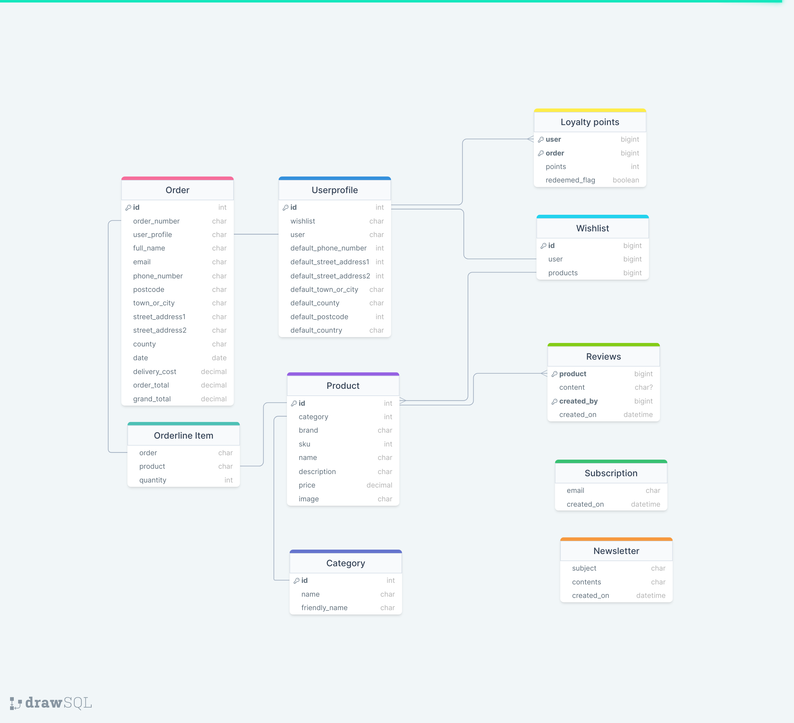
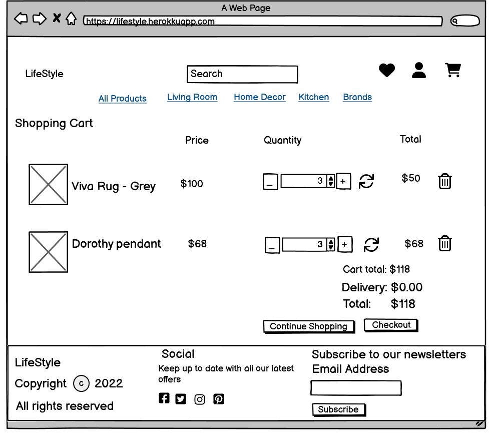
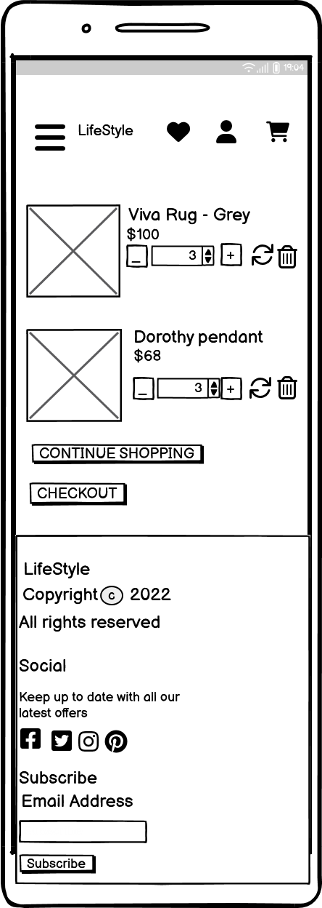
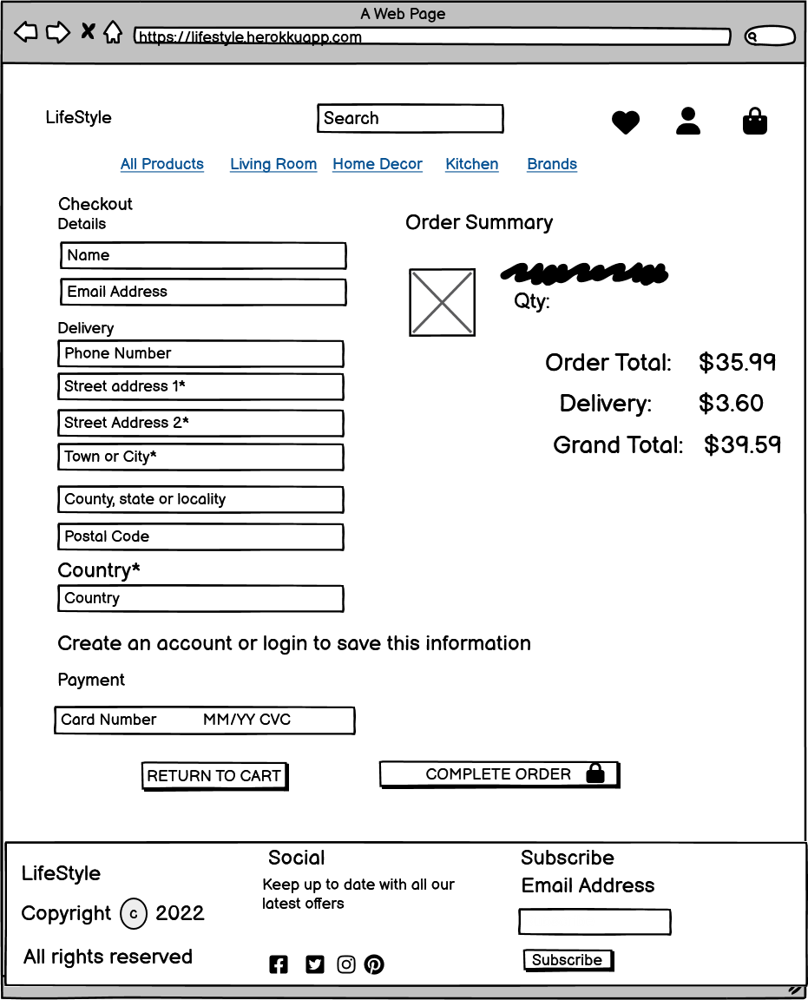
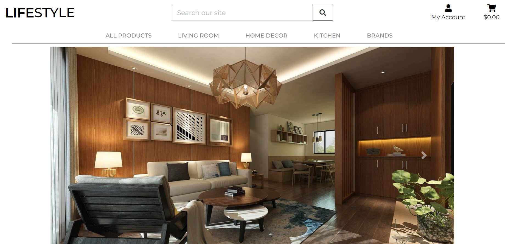
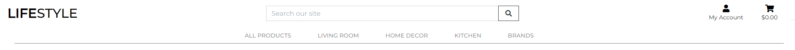
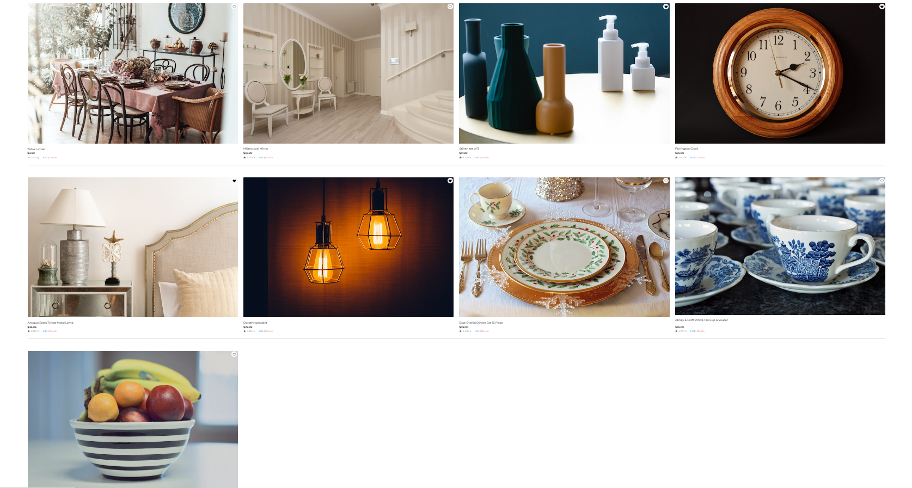
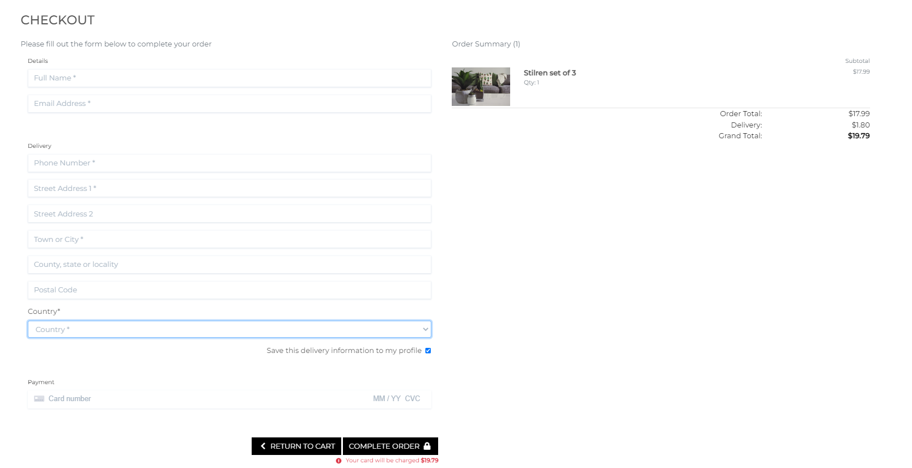
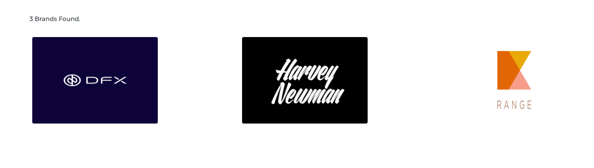
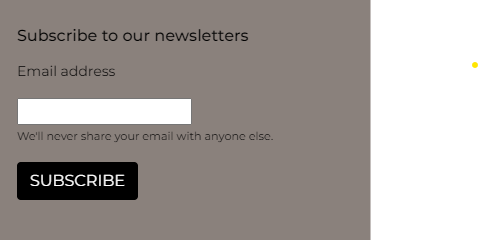

# LifeStyle
LifeStyle is a ecommerce website which offers different varieties of home decor products.

At LifeStyle we specialise in providing all aspects of homewares and want to make homewares as accessible and affordable as possible. 

LifeStyle have a great range of homewares and products, with many beautiful ornaments and items of home décor, and you’re sure to find something beautiful. We have homewares that can suit any home, and we always want to make your home more beautiful and somewhere special that is truly your own.

## Table of Contents

1. [User Experience (UX)](#user-experience-ux)
    1. [Strategy](#strategy)
        1. [Project Goals](#project-goals)
        2. [User Goals](#user-goals)
        3. [Strategy Table](#strategy-table)
    2. [Scope](#scope)
        1. [User Stories](#user-stories)
    3. [Structure](#structure)
        1. [Database Model](#database-model)
    4. [Skeleton](#skeleton)
        1. [Wireframes](#wireframes)
    5. [Surface](#surface)
        1. [Color Scheme](#color-scheme)
        2. [Typography](#typography)
2. [Marketing](#marketing)
   1. [Search Engine Optimisation](#search-engine-optimisation)
   2. [Business Model](#business-model)
3. [Features](#features)
   1. [General](#general)
   2. [Home Page](#home-page)
   3. [Products Page](#products-page)
   4. [Product Details Page](#product-details-page)
   5. [Products Admin](#products-admin)
   5. [Shopping cart Page](#shopping-cart-page)
   6. [Checkout Page](#checkout-page)
   7. [Checkout Success Page](#checkout-success-page)
   8. [Profile Page](#profile-page)
   9. [Whishlist Page](#favorites-page)
   10.[Brands Page](#reviews-page)
   11 [Accounts Pages](#accounts-pages)
   12.[404 Error Page](#404-error-page)
4. [Technologies Used](#technologies-used)
    1. [Languages Used](#languages-used)
    2. [Libraries and Frameworks](#languages-and-frameworks)
    3. [Packages / Dependencies Installed](#packages--dependencies-installed)
    4. [Database Management](#database-management)
    5. [Payment Service](#payment-service)
    6. [Cloud Storage](#cloud-storage)
    7. [Tools and Programs](#tools-and-programs)
5. [Testing](#testing)
6. [Resubmission](#resubmission)
7. [Deployment](#deployment)
    1. [How To Use This Project](#how-to-use-this-project)  
    2. [Deployment to Heroku](#deployment-to-heroku)   
    3. [AWS Bucket Creation](#aws-bucket-creation)  
    4. [Connect Django to AWS Bucket](#connect-django-to-aws-bucket)
8. [Finished Product](#finished-product)
9. [Credits](#credits)
10. [Known Issues](#known-issues)
11. [Acknowledgements](#acknowledgements)

***

## User Experience (UX)

### Strategy

#### Project Goals

* Simplified and secure online shopping experience for the customer.

* The website is easy to navigate and user friendly.

* Responsive web design to be compatible on all devices.

* Aesthetically pleasing website design and colors.

* Users will be able to register an account, add wish list, add cart and make secure payment.


#### User Goals

**Shopping Experience**

* As an online shopper, I want to easily find the products and their details.

* As an online shopper, I want to view products on a specific category.

* As an online shopper, I want to view products on a specific brand.

* As an online shopper, I want to add products to a whish list for later viewing.

* As an online shopper, I want to be able to sort the products depending on their price, rating or category.

* As an online shopper, I want to be able to search for products using specific keywords.

* As an online shopper, I want to easily select the quantity of products to be purchased.

* As an online shopper, I want to easily view the current purchase amount.

* As an online shopper, I want to securely make payment.

**Shopping Cart and Checkout**

* As an online shopper, I want to view all products currently on my shopping cart and be able to update them.

* As an online shopper, I want to easily provide my shipping and payment information during the checkout.

* As an online shopper, I want to make payments securely.

* As an online shopper, I want to receive an order confirmation once I have finished my purchase.


**User Accounts**

* As a frequent shopper, I want to register an account using my emailid and logon to the website subsequently.

* As a frequent shopper, I want to receive a confirmation email once my account has been registered to make sure the information entered was correctly.

* As a registered shopper, I want to easily sign in and sign out of my account.

* As a registered shopper, I want to be able to recover access to my account in case I forget my password.

* As a registered shopper, I want a profile page where my contact details are saved.

* As a registered shopper, I want to see historic order details.

**Product Admin**

* As an admin user, I want to add new products.

* As an admin user, I want to update existing products.

* As an admin user, I want to remove products.

**Wishlist**

* As a user, I want to add my favourite products to the wishlist to purchase in the future.

* As a user, I want to add and remove products from the wishlist.

**Newsletter Subscription**

* As an admin user, I want shoppers to be able to provide their contact information to be able to reach out to them with information and offers.

#### Strategy Table

Opportunity / Problem | Importance | Viability / Feasibility
--- | --- | ---
Account registration | 5 | 5
Create, edit and delete products | 5 | 5
User profile | 5 | 5
Responsive design | 5 | 5
Wishlist | 4 | 4
Order summary | 5 | 5
Search products by name or description | 5 | 5
Edit quantities inside the shopping cart | 4 | 4
Product details view | 5 | 5
View current shopping cart | 5 | 5
Newsletter subscription | 5 | 5
Card payment | 5 | 5
Display current purchase total | 5 | 5
Save delivery information | 5 | 5

[Back to top ⇧](#LifeStyle)

### Scope

According to the strategy table, not all features can be implemented in the first release of the project. For this reason, the project will be divided in multiple phases. The first phase will include the features that have been identified in order to build the minimum viable product.


**First Phase**

* Responsive design

* Create, edit and delete products

* Account registration

* User profile

* Save delivery information

* Sort products by different criteria

* Search products by name or description

* Product details view

* Display current purchase total

* View current shopping cart

* Edit quantities inside the shopping cart

* Card payment

* Newsletter subscription


**Second Phase**

* Rate products

* Product view

**Third Phase**

* Display similar products at the product details view

* Shopping cart quick view

* Wishlist

### User Stories

GitHub projects was used as a project management tool. Kanban board was used to add user stories.

**Week 1**


**Week 2**


**Week 3**


**Week 4**


**Week 5**


**Week 6**


**Week 7**


**Week 8**


[Back to top ⇧](#LifeStyle)

### Structure

The website has been organized in a Hierarchical Tree Structure to ensure the site user navigates through the site effortlessly and intuitively. 

* Header, footer and navigation bar are consistent through all pages.

* Links and forms provide clear feedback to the site user.

* New additional content features are provided for the shopper once they register an account.

* A 404-error page is available.


#### Database Model

The database model has been designed using [drawsql](https://drawsql.app/). The type of database being used for the is relational database being managed using SQLite3 during development and deployed using [elephantSQL](https://www.elephantsql.com/).



[Back to top ⇧](#LifeStyle)

### Skeleton

#### Wireframes

[Balsamiq](https://balsamiq.com/) has been used to showcase the appearance of the site and display the placement of the different elements whitin the pages.

Page | Desktop Version | Mobile Version
--- | --- | ---
Home |  | 
Products |  | 
Product Details |  | 
Shopping cart |  | 
Checkout |  | 
My profile |  | 

[Back to top ⇧](#LifeStyle)

### Surface

#### Color Scheme

 #8a817c is used in footer which have attractive and pleasant appearance overall.

 #000000 which is used for buttons throughout the website.


#### Typography
The font used across the whole site is Monsterrat. It is great for creating a simple and clean-looking web design and has high readability.

[Back to top ⇧](#LifeStyle)

## Marketing

### Search Engine Optimisation

Search Engine Optimisation means the process of improving your site to increase its visibility when people search for products or services.

The keywords for home decor are:

* decor
* home accessories
* interior design
* decor lighting
* lifestyle


**Facebook Business page**

See the live Facebook Business page [here](https://www.facebook.com/profile.php?id=100088453041010)


[Back to top ⇧](#LifeStyle)

## Features

* The website has been designed from a mobile user perspective.

* Responsive design across all devices.


### Home Page


* Display to the shopper the product categories available, providing a link to each category.

#### Header



* The header contains the main logo, navigation links and search product functionality.

* The main logo works as a link to the home page.

* The navigation links allow the shopper access to all sections to facilitate navigation across the website. 

* The shopping cart icon changes, reflecting the current status. The current shopping amount is displayed for the shopper.

* Wishlist allows shoppers to create personalized collections of products they want to buy and save them in their user account for future reference.

#### Footer


* The footer contains business information as well as links to our Facebook page and privacy policy.

* A newsletter registration form has been located at the footer allowing the shopper to subscribe across the whole website.


### Products Page


* Display all the products currently available or filtered on a specific category.

* Display an image of the products as well as their main information such as name, price and rating.

* Display the quantity of products currently being displayed.

* Provides a product navigation bar to allow the shopper to filter products per category.

* A link to the shopper favorite products is available on at the top of the page.

* Provides sorting functionality to sort products by price, rating, name or category.

* Links to edit and remove are available for each product.


### Product Details Page


* Headers and Navigation bar are displayed 

* Provide a larger image of the product and display its detailed information.

* The Description is shown in a bootstrap accordion.

* Allow the user to select the quantity of products to be added to the shopping cart.

* An "Add to cart" button is available to add the desired quantity of the product to the shopping cart.

* Provide edit and delete link for the admin users.

* The heart icon is embedded inside the product image so that the user can use it to add the current product to their wishlist.

### Product Reviews

* User can submit their reviews using the textarea provided.

* A User can only enter one review per product.

* All User reviews are displayed in chronological order.


### Products Admin

#### Add Product


* Allow the site admin to add new products to the store.

#### Edit Product


* Allow the site admin to edit an existing product.

### Shopping cart Page


* A notification message alerts the user in case the free delivery threshold has not been reached, displaying the amount left.

* Display all products currently on the shopping cart and their information.

* Allow the user to update the product quantity or remove the product from the shopping cart using the icons provided.

* Display the current total cost including the cart total and delivery costs.

* Provide a "Continue Shopping" button to go back to the products.

* A button to checkout is provided for the shopper to finish the purchase.

### Checkout Page



* Provide a checkout form for the shopper to complete the purchase and provide the necessary contact, shipping and payment information.

* Display an order summary listing all the products to be purchased and their total cost including the cart total and delivery costs.

* Provide a link back to the shopping cart in the case the shopper would like to adjust the products in the shopping cart.

* A message is displayed, informing the shopper the amount to be charged on the provided card.

* Descriptive error messages are displayed in case there is any issue with the payment information provided.

* A button is clearly available for the shopper to complete the order.

* Stripe webhook handler is created in the backend to pass the order information in the case the browser crashes once the checkout completion.

### Checkout Success Page


* Display the order and shopper information to allow the shopper to confirm that the information provided is correct.

* Additionally, informs the shopper that an email has been sent to the email address provided with the same information.

### My Profile Page


* Provide a form for the registered shopper to update their information.

* Show a list of historical orders.

* Shows available loyalty points.

### Wishlist Page


* Display the registered shopper's favorites products and displays them in Products page.

* Clicking the heart symbol will add and remove the products fron the wishlist.

### Brands Page



* Display all the brands from the products available in the website.

### Accounts Pages

Page | Purpose | 
--- | --- | 
Sign Up | Allow the shopper to sign up an account for the website.  
Sign In | Allow the registered shopper to sign in with their account. 
Sign Out | Allow the registered shopper to sign out from their account.

### Newsletter Subscription in Footer



### Newsletter Email Functionality


Page | Purpose | 
--- | --- | 
Newsletter Email | Allows the Admin to send a newsletter in an email through Admin page. Admin needs to upload a html file containing the body of email.


### 404 Error Page

* Provided information to the shopper in case the address entered cannot be found.

* A link to come back to the products is present.

[Back to top ⇧](#LifeStyle)


## Technologies Used

### Languages Used

* [HTML5](https://en.wikipedia.org/wiki/HTML)
* [CSS3](https://en.wikipedia.org/wiki/CSS)
* [JavaScript](https://en.wikipedia.org/wiki/JavaScript)
* [Python](https://en.wikipedia.org/wiki/Python_(programming_language))


### Libraries and Frameworks

* [Django](https://www.djangoproject.com/) was used as web framework.

* [Django Template](https://jinja.palletsprojects.com) was used as a templating language for Django to display backend data to HTML.
   
* [jQuery 3.6.0](https://jquery.com/) was used as a JavaScript library to help writing less JavaScript code. 

* [Bootstrap 5](https://getbootstrap.com/docs/5.0/getting-started/introduction/) was used throughout the website to help with styling and responsiveness.

* [Google Fonts](https://fonts.google.com) was used to import the font into the html file, and were used on all parts of the site.

* [Font Awesome](https://fontawesome.com) was used throughout the website to add icons for aesthetic and UX purposes. 


### Packages / Dependencies Installed

* [Django Allauth](https://django-allauth.readthedocs.io/en/latest/) was used for user authentication, registration, and account management.

* [Django Crispy Form](https://django-crispy-forms.readthedocs.io/en/latest/) was used to control the rendering of the forms. 

* [Django Countries](https://pypi.org/project/django-countries/) was used to provide country choices for use with forms and a country field for models.

* [Pillow](https://pypi.org/project/Pillow/) was used to add image processing capabilities.  
 
* [Gunicorn](https://gunicorn.org/) was used as Python WSGI HTTP Server for UNIX to support the deployment of Django application.  


### Database Management
* [SQLite](https://www.sqlite.com/index.html) was used as a single-file database for development environment.

* [Heroku ElephantSql](https://www.heroku.com/ElephantSql) cloud database was used in production environment.


### Payment Service

* [Stripe](https://stripe.com/en-gb-nl) was used to process all online payments transactions.


### Cloud Storage

* [Amazon Web Service S3](https://aws.amazon.com/s3/) was used to store all static and media files in production.

### Tools and Programs

* [Git](https://git-scm.com)  
    * Git was used for version control by utilizing the Gitpod terminal to commit to Git and Push to GitHub. 
    * A Tag 'submission-17-12-2022' was created on the main branch that has the project's first submission
    * The resubmission work was done on 'resubmission' branch and then merged to main branch towards the end of development.

* [GitPod](https://gitpod.io/)
     * GitPod was used for writing code, committing, and then pushing to GitHub.

* [GitHub](https://github.com)  
   GitHub was used to store the projects code after being pushed from Git. 

* [Heroku](https://www.heroku.com)   
    * Heroku was used to deploy the website.

* [Coolors](https://coolors.co)  
    * Coolors was used to create a color scheme for the website.

* [Balsamiq](https://balsamiq.com/)
     * Balsamiq was used to create the wireframes during the design phase of the project

* [Chrome DevTools](https://developer.chrome.com/docs/devtools/)
    * Chrome DevTools was used during development process for code review and to test responsiveness.

* [W3C Markup Validator](https://validator.w3.org/)
    * W3C Markup Validator was used to validate the HTML code.

* [W3C CSS Validator](https://jigsaw.w3.org/css-validator/)
    * W3C CSS Validator was used to validate the CSS code.

[Back to top ⇧](#LifeStyle)


### Testing

Manual testing was done throughout the application to verify functionalities.

#### General

Element | Expected Outcome | Pass/Fail |
--- | --- | --- |
Website Logo Link | When clicking the logo, the browser redirects me to the home page. | Pass |
My Account Icon - Register Link | When clicking the link, the browser redirects to the account sign up page. | Pass |
My Account Icon - Login Link | When clicking the link, the browser redirects to the account sign in page. | Pass |
My Account Icon - Logout link | When clicking the link, the browser redirects to the account sign out page. | Pass |
My Account Icon - Product Management Link | When clicking the link, the browser redirects to the add product page. | Pass |
My Account Icon - My Profile Link | When clicking the link, the browser redirects to the profile page. | Pass |
Shopping Cart Icon | When clicking the link, the browser redirects to the shopping cart. | Pass |
Search Bar | When clicking the link, the browser redirects to the products page and display the matching products. | Pass |
Privacy Policy Link | When clicking the link, the browser opens the privacy policy. | Pass |
Facebook Icon | When clicking the link, the browser open the business Facebook page on a separate tab. | Pass |
Newsletter Form | Email address gets registered to the database when submitting the form. | Pass |

#### Home Page

#### Home Page - Navigation

Element | Expected Outcome | Pass/Fail |
--- | --- | --- |
All Products | When Clicked, the screen shows the Products page and displays all the products. | Pass |
Living Room | When Clicked, the screen shows the Products page and displays only the products in 'Living Room' catagory. | Pass |
Home Decor | When Clicked, the screen shows the Products page and displays only the products in 'Home Decor' catagory. | Pass |
Kitchen | When Clicked, the screen shows the Products page and displays only the products in 'Kitchen' catagory. | Pass |
Brands | When Clicked, the screen shows the Brands page and displays all the 'Brands' available. | Pass |

#### Products Page

Element | Expected Outcome | Pass/Fail |
--- | --- | --- |
Product Navigation Bar Links | Clicking any of the links will filter the products on that category. | Pass |
Sort By Selector | Sort by functionality sort the products depending on the selection. | Pass |
Wishlist Link | Clicking the link redirects to the Products page. | Pass |
Product Image | Clicking the image redirect to the product details page for that specific product. | Pass |
Product Edit Link | Clicking the link redirects to the edit product page. | Pass |
Product Delete Link | Clicking the link delete the product from the database. | Pass |


#### Products Sorting

Element | Expected Outcome | Pass/Fail |
--- | --- | --- |
Sort By Price (low to high) | Products should be listed in the ascending order of price. | Pass |
Sort By Price (high to low) | Products should be listed in the descending order of price. | Pass |
Sort By Rating (low to high) | Products should be listed in the ascending order of rating. | Pass |
Sort By Rating (high to low) | Products should be listed in the descending order of rating. | Pass |
Sort By Name (A to Z) | Products should be listed in the ascending order of alphabets. | Pass |
Sort By Name (Z to A) | Products should be listed in the descending order of alphabets. | Pass |

#### Product Details Page

Element | Expected Outcome | Pass/Fail |
--- | --- | --- |
Product Navigation Bar Links | Clicking any of the links will redirect to the products page and filter the products on that category. | Pass
Product Image | Clicking the image opens the image on a separate tab. | Pass |
Product Edit Link | Clicking the link redirects to the edit product page. | Pass |
Product Delete Link | Clicking the link deletes the product from the database. | Pass |
Decrease Quantity Button | Decreases the quantity on the input form. | Pass |
Increase Quantity Button | Increases the quantity on the input form. | Pass |
Continue Shopping Button | Clicking the button redirects to the products page. | Pass |
Add To Cart Button | Clicking the button adds the specified quantity of the product to the shopping cart. | Pass |

#### Add Product Page

Element | Expected Outcome | Pass/Fail |
--- | --- | --- |
Select Image Button | Clicking the button allows to add an image to the form | Pass |
Add Product Form | Product gets registered to the database when submitting the form. | Pass |
Cancel Button | Clicking the button redirects to the products page. | Pass |


#### Edit Product Page

Element | Expected Outcome | Pass/Fail |
--- | --- | --- |
Select Image Button | Clicking the button allows to add or replace the image | Pass |
Edit Product Form | Product gets updated when submitting the form. | Pass |
Cancel Button | Clicking the button redirects to the products page. | Pass |


#### Shopping cart Page

Element | Expected Outcome | Pass/Fail |
--- | --- | --- |
Decrease Quantity Button | Decreases the quantity on the input form. | Pass |
Increase Quantity Button | Increases the quantity on the input form. | Pass |
Update Link | Clicking the link update the product quantity on the shopping cart. | Pass
Delete Link | Clicking the link removed the product from the shopping cart. | Pass
Keep Shopping Button | Clicking the button redirects to the products page. | Pass |
Secure Checkout Button | Clicking the button redirects to the checkout page. | Pass |


#### Checkout Page

Element | Expected Outcome | Pass/Fail |
--- | --- | --- |
Checkout Form | An order gets created when submitted the form. | Pass |
Login Link | Clicking the link redirects to the account sign in page. | Pass |
Register Link | Clicking the link redirects to the account sign up page. | Pass |
Save Information Check | Checking the box update the user's profile information during the checkout process. | Pass |
Adjust cart Link | Clicking the link redirects to shopping cart page. | Pass |


#### Checkout Success Page

Element | Expected Outcome | Pass/Fail |
--- | --- | --- |
Now checkout the latest deals | Clicking the button redirects to the products page. | Pass |


#### Profile Page

Element | Expected Outcome | Pass/Fail |
--- | --- | --- |
Update Information Form | User's information gets updated when submitting the form. | Pass |
Order Link | Clicking the link redirects to order view. | Pass |


#### Wishlist Page
Element | Expected Outcome | Pass/Fail |
--- | --- | --- |
Add | Clicking the heart icon will add product to the wishlist. | Pass |
Remove | Clicking the heart icon will remove the product from the wishlist. | Pass |

#### Brands page
Element | Expected Outcome | Pass/Fail |
--- | --- | --- |
Brands link | Clicking the brands displays the various brands | Pass |

#### Reviews
Element | Expected Outcome | Pass/Fail |
--- | --- | --- |
Create | On submitting a review, the content is successfully saved| Pass |
Duplicate Review| User cannot create more than one review and the textarea will not be visible| Pass |
Access| Only logged in users can submit a review | Pass |

#### Subscription
Element | Expected Outcome | Pass/Fail |
--- | --- | --- |
Create Subscription |Entered email id is saved in the Subscription model| Pass |
Duplicate Subscription |Error message saying entered email is already subscribed is shown| Pass |

#### Newsletter
Element | Expected Outcome | Pass/Fail |
--- | --- | --- |
Create Newsletter|A newsletter is successfully saved in the model with entered Subject and HTML| Pass |
View Newletter|Admin is able to see the newsletters in the dropdown| Pass |
Send Newletter|Admin is able to selct the newsletters and send news letters to all Subscribers| Pass |
Newletter Email |Email is sent out to all Subscribers| Pass |

#### Loyalty Points
Element | Expected Outcome | Pass/Fail |
--- | --- | --- |
Create Loyalty points | When Checkout is success, Loyalty points are added to the user's order | Pass |
View Loyalty points | Total available Loyalty points are shown in User profile page | Pass |


#### Known Issues
Scenario | Issue |
--- | --- |
Payment Confirmation | Confirmation email is not sent out to the customer's email address |
Footer position for tablets| There is a small gap between footer and bottom of page in the home screen in tablet devices.|
Product Details| When Heart icon in the products image is clicked, 'Product added from Wishlist' message is shown along with the Shopping cart information|
Python Validation | Line too long violation in /checkout/webhook_handler.py is not fixed. |

#### Future Enhancements
Scenario | Issue |
--- | --- |
Loyalty points | A Redeem functionality to help customers use their accumulated points|

### Resubmission

Comment | Fix Approach | Status
--- | --- | --- |
Issues in navigation are present. A majority of the text is hidden behind <br> the footer on the email verification page and the sign-up page fields overlap <br>the footer significantly on mobile screens.  | Responsiveness handled in CSS by setting minimum window height | Fixed |
Inadequate or zero customization of the boilerplate Django model taught on the course | Code modified |Fixed |
Missing adequate UX design leads to a poor experience at the front-end. | Code modified| Fixed|
Email verification page is difficult to use making registration of new users difficult| Screen size increased | Fixed |
Code does not pass through validation tools. | Used flake8 to fix. | Fixed|
Custom Models | New models created are Review, Subscription, Newsletter, Loyalty points | Fixed|


## Code Validation


### HTML

* [W3C Markup Validator](https://validator.w3.org/) for HTML validation

### CSS
* [W3C CSS Validator](https://jigsaw.w3.org/css-validator/) found no errors on base.css file.

### Python

Pylint was used continuously during the development process to analyze the Python code for programming errors.

The code was then checked for errors via the terminal command "python3 -m flake8". This returned a number of whitespace and indentation errors which were rectified where possible. (The unfixed errors were situated in root files such as .vscode/artictern)

Other errors regarding unused imports were corrected by removing the unnecessary files.

[Back to top ⇧](#LifeStyle)

## Deployment
 
* This project was developed using a GitPod workspace. The code was committed to Git and pushed to GitHub using the terminal.

* Log in to [Heroku](https://id.heroku.com/login) or create an account
* On the main page click New and Create New App
* Note: new app name must be unique
* Next select your region, I chose Europe.
* Click Create App button
* Click in resources and select Heroku Postgres database
* Click Reveal Config Vars and add new config "SECRET_KEY"
* Click Reveal Config Vars and add new config "DISABLE_COLLECTSTATIC = 1"
* The next page is the project’s Deploy Tab. Click on the Settings Tab and scroll down to Config Vars
* Next, go to Buildpack section click Add Buildpack select python and Save Changes
* Scroll to the top of the page and choose the Deploy tab
* Select Github as the deployment method
* Confirm you want to connect to GitHub
* Search for the repository name and click the connect button
* Scroll to the bottom of the deploy page and select the preferred deployment type
* Click either Enable Automatic Deploys for automatic deployment when you push updates to Github

* As Heroku Student Pack no longer includes free access to the Postgres add-on I had to migrate Postgres databases from Heroku to keep ElephantSQL.
* Navigate to ElephantSQL.com and click “Get a managed database today”
* Select “Try now for FREE” in the TINY TURTLE database plan
* Select “Log in with GitHub” and authorize ElephantSQL with your selected GitHub account
* In the Create new team form

### Migrating databases
* Create a database
* Log in to ElephantSQL.com to access your dashboard
* Click “Create New Instance”
* Set up your plan
* Select “Select Region” EXAMPLE "EU-West-1 (Ireland)"
* Then click “Review”
* Check your details are correct and then click “Create instance”
* Return to the ElephantSQL dashboard and click on the database instance name for this project

### Migrating your data
* Navigate to the Postgres Migration Tool repo on github in a new browser tab
* Click the Gitpod button to open a new workspace
* Run the script " python3 reel2reel.py" command in the terminal
* In a different browser tab, go to your app in Heroku and select the Settings tab
* Click the “Reveal Config Vars” button
* Copy the value in the DATABASE_URL Config Var. It will start with postgres://
* Return to Gitpod and paste in the URL you just copied into the terminal where prompted to provide your DATABASE_URL and click enter
* In your original browser tab, get your ElephantSQL database URL. Again, it will start with postgres://
* Return to Gitpod and paste in the URL where prompted
* The data will now be downloaded from Heroku and uploaded to your ElephantSQL database
* To test that your database has been moved successfully, return to ElephantSQL and select BROWSER
* Click the “Table queries” button. If you see any options in the dropdown, your tables have been created
* Select a table name you recognise, and then click “Execute”
* You should see your data displayed relating to the table you selected

### Connecting ElephantSQL database to Heroku
* In the Heroku Dashboard for your project, open the Resources tab
* In the Resources tab, remove the existing Postgres add-on:
* Confirm by typing in the name of your Heroku app when prompted.
* Navigate to the Settings tab
* Reveal your existing Config Vars. The original DATABASE_URL should have been deleted when the add-on was removed.
* Add a new config var called DATABASE_URL and paste in the value for your ElephantSQL database, and click Add to save it.
* Check the Activity tab to confirm


### Final Deployment 

* Create a runtime.txt `python-3.8.14`
* Create a Procfile `web: gunicorn life_style.wsgi:application`
* When development is complete change the debug setting to: `DEBUG = False` in settings.py
* In Heroku settings, delete the config vars for `DISABLE_COLLECTSTATIC = 1`

### How To Use This Project
To use and further develop this project you can either fork or clone the repository.  


#### Fork GitHub Repository
By forking the GitHub repository you can make a copy of the original repository on your GitHub account to view and/or make changes without affecting the original repository, by using the following steps:  

1. Log in to GitHub.  
2. Navigate to the main page of the GitHub Repository that you want to fork.  
3. At the top right of the Repository just below your profile picture, locate the "Fork" button.  
4. You should now have a copy of the original repository in your GitHub account.  
5. Changes made to the forked repository can be merged with the original repository via a pull request.  


#### Clone Github Repository
By cloning a GitHub repository you can create a local copy on your computer of the remote repository. The developer who clones a repository can synchronize their copy of the codebase with any updates made by fellow developers with push or pull request. Cloning is done by using the following steps:  

1. Log in to GitHub.  
2. Navigate to the main page of the GitHub Repository that you want to clone.  
3. Above the list of files, click the dropdown called "Code".  
4. To clone the repository using HTTPS, under "HTTPS", copy the link.  
5. Open Git Bash.  
6. Change the current working directory to the location where you want the cloned directory to be made.  
7. Type git clone, and then paste the URL you copied in Step 4.  
```$ git clone https://github.com/YOUR-USERNAME/YOUR-REPOSITORY```
8. Press Enter. Your local clone will be created.   
```
$ git clone https://github.com/YOUR-USERNAME/YOUR-REPOSITORY
> Cloning into `CI-Clone`...
> remote: Counting objects: 10, done.
> remote: Compressing objects: 100% (8/8), done.
> remove: Total 10 (delta 1), reused 10 (delta 1)
> Unpacking objects: 100% (10/10), done.
```  
Changes made on the local machine (cloned repository) can be pushed to the upstream repository directly if you have a write access for the repository. Otherwise, the changes made in the cloned repository are first pushed to the forked repository, and then a pull request is created.  
Click [Here](https://docs.github.com/en/github/creating-cloning-and-archiving-repositories/cloning-a-repository-from-github/cloning-a-repository) to retrieve pictures for some of the buttons and more detailed explanations of the above process.  


#### Project Set Up After Forking or Cloning  
1. Install all dependencies by typing in the CLI ```pip3 install -r requirements.txt```  
2. Create a ```.gitignore``` file and ```env.py``` file in the project's root directory. Add the ```env.py``` file to ```.gitignore```. 
3. Inside the env.py file, enter the project's environment variables:   
   ```
   import os

   os.environ.setdefault("SECRET_KEY", <your_secret_key>)
   os.environ.setdefault("DEVELOPMENT", '1')
   os.environ.setdefault("STRIPE_PUBLIC_KEY", <your_key>)
   os.environ.setdefault("STRIPE_SECRET_KEY", <your_key>)
   os.environ.setdefault("STRIPE_WH_SECRET", <your_key>)
   ```   
   You can get the keys from:
   - "SECRET_KEY" can be generated using [Django Secret Key Generator](https://miniwebtool.com/django-secret-key-generator/)   
   - "STRIPE_PUBLIC_KEY" and "STRIPE_SECRET_KEY" can be generated by creating a stripe account. The keys are found in 'Developers' Section, under 'API Keys'.  
   - In the Developer Section, under 'Webhooks', add a new endpoint.  "STRIPE_WH_SECRET". On Endpoint URL, enter:  
   ``` https://<your_host_url>/checkout/wh/ ```   
   Select to listen to all events, and create endpoint, and you can view your "STRIPE_WH_SECRET".   

4. Make migrations to setup the inital database operations.  
   ``` 
   python3 manage.py makemigrations 
   python3 manage.py migrate 
   ```   
5. Load data for the database or create data manually. 
   ```
   python3 manage.py loaddata <app_name>
   ``` 
6. Create a super user.
   ```
   python3 manage.py create superuser
   ```  
The project should now complete to run and can now be used for development. To run the project, type in the CLI terminal: ```python3 manage.py runserver```     

### Deployment to Heroku 
This project is deployed on Heroku for production, with all static and media files stored on AWS S3. These are steps to deploy on Heroku:

1. Navigate to Heroku.com, create a new account or login if you already have an account. On the dashboard page, click "Create New App" button. Give the app a name, the name must be unique with hypens between words. Set the region closest to you, and click "Create App".   
2. On the resources tab, provision a new Heroku Postgres database.  
3. Configure variables on Heroku by navigating to Settings, and click on Reveal Config Vars. You may not have all the values yet. Add the others as you progress through the steps.   
   Varables | Key   
   ---| ---   
   AWS_ACCESS_KEY_ID | your_access_key_id_from_AWS   
   AWS_SECRET_ACCESS_KEY | your_secret_access_key_from_AWS  
   DATABASE_URL | your_database_url   
   EMAIL_HOST_PASS | your_app_password_from_your_email   
   EMAIL_HOST_USER | your_email_address  
   SECRET_KEY | your_secret_key 
   STRIPE_PUBLIC_KEY | your_stripe_public_key  
   STRIPE_SECRET_KEY | your_stripe_secret_key  
   USE_AWS | True 

   ## Credits

   ### Media

   * [Pexels](https://www.pexels.com/)

   ### Code

    * The code in Code Institute's video on the Boutique Ado project was used as the main reference point to set up an e-commerce / online store project using HTML, CSS, JS, Python+Django, PostgreSQL database, Stripe, and AWS S3 as storage.  

     [Stack Overflow](https://stackoverflow.com/) were referenced to get better ideas in order to understand and implement the code.

     [Bootstrap](https://getbootstrap.com/) were referenced for the bootstrap ideas. 

     [Django](https://docs.djangoproject.com/en/4.1/) was referenced for Django.

     [Blog](https://www.twilio.com/blog/build-email-newsletter-django-twilio-sendgrid) was referenced for Newsletter email functionality.


   ## Acknowledgements  

   * Thanks to my mentor Marcel Mulders for his support and feedback.

   * Thanks to the tutor support in code institute and slack community for their support.
